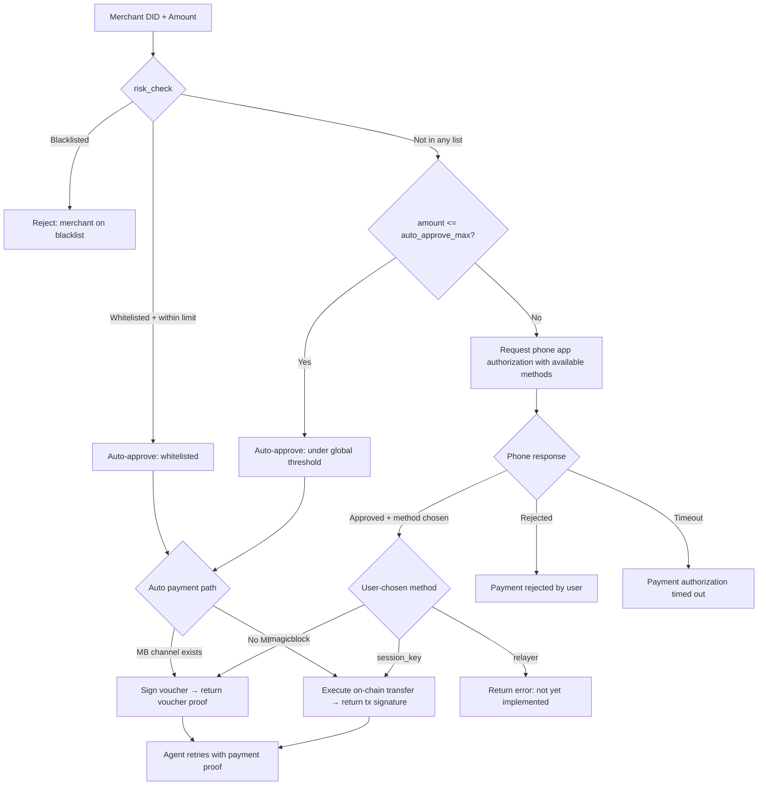

# Agent Payment Flow

## 1. Overview

This document describes the end-to-end payment flow when an AI Agent encounters a paywalled resource protected by the [x402 protocol](https://www.x402.org/).

### Participants

| Participant | Role |
|---|---|
| **AI Agent** (OpenClaw) | Initiates requests to external services; receives HTTP 402 challenges |
| **External Service** (x402) | Hosts paid resources; returns HTTP 402 with payment requirements |
| **Ignite Pay MCP** | Local payment orchestrator: parses challenges, verifies merchants, manages auth, executes payment |
| **DIDComm Mediator** | Relay server for encrypted DIDComm messages between MCP and phone app |
| **Phone App** | Mobile wallet that authorizes payments, creates session keys, signs transactions |
| **Solana Chain** | Settlement layer for SOL/SPL token transfers, session key contracts, and ZK compressed DID accounts |
| **MagicBlock** | Unified global vault with per-merchant spending cap accounting, off-chain voucher signing, on-chain batch settlement |

### Trigger

The flow begins when an AI Agent requests a paid resource and receives an HTTP 402 response containing payment requirements in either the Coinbase x402 standard format or a legacy `accepts` array format.

### Two Payment Paths

After authorization, the MCP can execute payment via one of three paths (user chooses during authorization):

| Path | Mechanism | Proof Type | When Used |
|------|-----------|------------|-----------|
| **Session Key** | On-chain SOL/SPL transfer via session key contract | Solana tx signature | Direct payments, one-time transfers |
| **MagicBlock Channel** | Off-chain voucher signing from unified global vault (buyer signs `SHA256(channel_id ‖ seq ‖ amount)`) | Voucher (msg_hash + buyer signature) | Recurring payments, channel-based flows |
| **Relayer** (future) | Delegated payment via relayer service | TBD | Third-party payment, gasless flows |

The MCP determines available methods based on the current state (e.g., MagicBlock channel exists?) and includes them in the `payment-auth-request`. The phone user selects a method, and the MCP executes via the chosen path. Both current paths return a payment proof that the Agent uses to retry the original request.

---

## 2. Sequence Diagram

```mermaid
sequenceDiagram
    participant Agent as AI Agent
    participant MCP as Ignite Pay MCP
    participant Store as PaymentStore (sled)
    participant IPFS as IPFS
    participant Chain as Solana Chain
    participant Mediator as DIDComm Mediator
    participant Phone as Phone App

    Note over Agent,Phone: Step 1 — Agent hits paywall
    Note over Agent: Agent requests paid resource from external service
    Note over Agent: External service returns HTTP 402 + payment requirements

    Note over Agent,MCP: Step 2 — Agent calls MCP
    Agent->>MCP: process_x402_challenge(challenge_body, headers)

    Note over MCP: Step 3 — Parse x402 challenge
    MCP->>MCP: Parse Coinbase x402 or legacy format
    MCP->>MCP: Extract network, amount, token, recipient, merchant_did

    Note over MCP,Store: Step 4 — Create payment record
    MCP->>Store: save_payment(PaymentRequest)
    Store-->>MCP: OK

    Note over MCP,IPFS: Step 5 — VC verification
    alt Inline VC in challenge
        MCP->>MCP: Parse verifiable_credential from JSON
        MCP->>MCP: VC.verify(platform_key, platform_did)
    else IPFS CID provided
        MCP->>IPFS: resolve_vc_from_ipfs(cid)
        IPFS-->>MCP: VerifiableCredential JSON
        MCP->>MCP: VC.verify(platform_key, platform_did)
    else No VC
        MCP->>MCP: Skip VC verification
    end

    Note over MCP,Chain: Step 6 — On-chain merchant DID verification
    MCP->>MCP: SolanaDidBridge.quick_verify(merchant_did)
    MCP->>Chain: Photon getCompressedAccount(derived_address)
    alt Account exists
        Chain-->>MCP: account data
        MCP->>MCP: Merchant verified
    else Account not found
        Chain-->>MCP: null
        MCP-->>Agent: "Payment rejected: merchant not found on-chain"
    end

    Note over MCP: Step 7 — Risk control decision
    MCP->>MCP: list_store.risk_check(merchant_did, amount)
    alt Blacklisted
        MCP-->>Agent: "Payment blocked: merchant is on blacklist"
    else Whitelisted + within limit
        MCP->>MCP: Auto-approve → execute payment
        MCP-->>Agent: Payment proof
    else Within global threshold
        MCP->>MCP: Auto-approve → execute payment
        MCP-->>Agent: Payment proof
    else Needs authorization
        MCP->>MCP: Continue to phone auth
    end

    Note over MCP,Mediator,Phone: Step 8 — Send auth request to phone
    MCP->>MCP: Determine available payment methods (session_key + magicblock if channel exists)
    MCP->>Mediator: DIDComm payment-auth-request (with available_payment_methods)
    Mediator->>Phone: Forward encrypted message

    Note over Phone: Step 9 — User reviews and approves
    Phone->>Phone: Display payment details + available payment methods
    Phone->>Phone: User selects payment method and taps Approve/Reject

    Note over Phone,Chain,MCP: Step 10 — Phone sends auth response
    Phone->>Phone: Optionally create session key + register on-chain
    Phone->>Mediator: DIDComm auth response (approval + payment_method + optional session key)
    Mediator->>MCP: Forward encrypted response

    Note over MCP,Chain: Step 11 — MCP executes payment via user-chosen method
    alt User chose MagicBlock channel
        MCP->>MCP: mb_sign_voucher(channel_id, seq, amount)
        Note over MCP: Buyer signs SHA256(channel_id ‖ seq ‖ amount)
        MCP->>Store: Store signed voucher
        MCP-->>Agent: Voucher proof (msg_hash + signature)
    else User chose Session key on-chain transfer
        MCP->>Chain: execute_payment() via session key
        Chain-->>MCP: Transaction signature
        MCP->>Store: update_status(Executed)
        MCP-->>Agent: Tx signature proof
    else User chose Relayer (future)
        MCP-->>Agent: Error: not yet implemented
    end

    Note over Agent,MCP: Step 12 — Agent retries with payment proof
    Agent->>External: Retry original request with X-Payment-Proof header
    External->>External: Verify payment proof (on-chain tx or voucher)
    External-->>Agent: Return paid resource
```

---

## 3. Risk Control Decision Flow



---

## 4. Payment Proof Types

### 4.1 MagicBlock Voucher (Off-chain)

When a payment channel exists with the merchant, the MCP signs a voucher off-chain:

```
Voucher proof returned to Agent:
  Channel: <channel_pda>
  Seq: <sequence_number>
  Amount: <lamports>
  Signature: <base58 Ed25519 signature>
  Message hash: <base58 SHA256(channel_id ‖ seq ‖ amount)>
```

The voucher is stored locally in sled (`VoucherStore`) for future batch settlement. The merchant can later settle batches of vouchers on-chain via `settle_batch` or `optimistic_settle`.

**MCP tool:** `mb_sign_voucher(merchant_pubkey, seq, amount)`

### 4.2 Session Key Transaction (On-chain)

When no payment channel exists, the MCP executes a direct on-chain transfer via the session key contract:

```
Tx proof returned to Agent:
  "Payment authorized and executed. Tx: <base58 Solana tx signature>
   Amount: <amount> <token>
   To: <recipient>"
```

**MCP function:** `execute_payment_auto(payment, session_key, spl_params)` — tries MagicBlock first, then falls back to `execute_payment(session_key)` for on-chain transfer

---

## 5. Code Location Mapping

| Step | Description | File | Lines |
|------|-------------|------|-------|
| 3 | Parse x402 challenge (Coinbase + legacy) | `ignite-pay-mcp/src/main.rs` | ~478–530 |
| 3 | Resolve SPL token mint | `ignite-pay-mcp/src/main.rs` | ~532–550 |
| 4 | Create and save payment record | `ignite-pay-mcp/src/main.rs` | ~551–575 |
| 5a | VC verification (inline) | `ignite-pay-mcp/src/main.rs` | ~584–606 |
| 5b | VC verification (IPFS CID) | `ignite-pay-mcp/src/main.rs` | ~607–646 |
| 6 | On-chain DID verification | `ignite-pay-mcp/src/main.rs` | ~648–668 |
| 6 | `quick_verify` implementation | `ignite-pay-core/src/solana_did.rs` | 52–79 |
| 7 | Risk control decision | `ignite-pay-mcp/src/main.rs` | ~724–768 |
| 7 | Global threshold auto-approve | `ignite-pay-mcp/src/main.rs` | ~770–801 |
| 8 | Determine available payment methods | `ignite-pay-mcp/src/main.rs` | `get_available_payment_methods()` |
| 8 | Send DIDComm auth request (with methods) | `ignite-pay-mcp/src/main.rs` | ~833–860 |
| 8 | DIDComm message building | `ignite-pay-mcp/src/mediator.rs` | ~267–320 |
| 8 | `PaymentMethod` enum | `ignite-pay-core/src/didcomm.rs` | ~12–30 |
| 9–10 | Phone app bridge functions | `ignite_pay_app/rust/src/api/simple.rs` | — |
| 10 | Session key creation + registration | `ignite_pay_app/rust/src/api/session.rs` | — |
| 11a | `execute_payment` (session key path) | `ignite-pay-mcp/src/main.rs` | ~216–259 |
| 11 | `PaymentProof` enum | `ignite-pay-mcp/src/main.rs` | ~262–291 |
| 11 | `try_mb_voucher_payment` (MagicBlock path) | `ignite-pay-mcp/src/main.rs` | ~294–362 |
| 11 | `execute_payment_auto` (method-aware dispatcher) | `ignite-pay-mcp/src/main.rs` | `execute_payment_auto()` |
| 11 | `has_mb_channel` (channel check) | `ignite-pay-mcp/src/main.rs` | `has_mb_channel()` |
| 11b | `mb_sign_voucher` (standalone tool) | `ignite-pay-mcp/src/main.rs` | ~1535–1580 |
| 11b | Voucher signing logic | `ignite-pay-mb/sdk/src/signing.rs` | 33–49 |
| 11b | Voucher storage | `ignite-pay-mcp/src/voucher_store.rs` | — |
| 12 | Result returned to Agent | `ignite-pay-mcp/src/main.rs` | ~900–960 |

### MagicBlock Channel Lifecycle Tools

| Tool | File:Lines | Description |
|------|-----------|-------------|
| `mb_init_global` | `main.rs:1320` | Create global state + vault PDAs (one-time) |
| `mb_deposit` | `main.rs:1344` | Deposit SOL into global vault |
| `mb_create_channel` | `main.rs:1369` | Open payment channel with merchant |
| `mb_update_spending_cap` | `main.rs:1405` | Adjust merchant spending cap |
| `mb_get_channel` | `main.rs:1439` | Read on-chain channel state |
| `mb_get_global_state` | `main.rs:1470` | Read on-chain global state |
| `mb_sign_voucher` | `main.rs:1493` | Sign off-chain payment voucher |
| `mb_sign_settlement` | `main.rs:1539` | Rebuild merkle tree, sign batch settlement |
| `mb_dispute` | `main.rs:1619` | File dispute against settlement |
| `mb_resolve_dispute` | `main.rs:1661` | Provide merkle proof to resolve dispute |
| `mb_withdraw` | `main.rs:1736` | Withdraw unallocated SOL from vault |

---

## 6. Configuration

Relevant `config.toml` fields:

```toml
[solana]
# Solana RPC endpoint
rpc_url = "https://api.devnet.solana.com"
# DID program ID (ignite-pay-did-program) — enables on-chain DID verification
did_program_id = ""
# Photon RPC URL for ZK Compression queries — used by quick_verify
photon_url = ""
# Address Merkle tree pubkey — used to derive compressed DID addresses
address_tree = ""
# Payment mode: "self_funded" or "sponsored"
pay_mode = "self_funded"
# Default owner pubkey (base58) for local session lookup
default_owner = ""

[magicblock]
# MagicBlock RPC endpoint
rpc_url = "https://api.devnet.solana.com"
# MagicBlock on-chain program ID
program_id = "6pFXAg1oiV61wVvaJvMHqYdGMe2fscDwmN9UBUSvNuU3"

[policy]
# Auto-approve payments under this amount (in smallest unit, e.g. lamports)
auto_approve_max = 0
# Authorization request timeout in seconds
auth_timeout = 300

[platform]
# Platform DID that issues merchant VCs
did = "did:ignite:zPlatformDIDPlaceholder"
# Platform Ed25519 verifying key (base64 no-pad) — used for VC verification
verifying_key_b64 = ""
```

---

## 7. Known Stubs and Gaps

| Item | Location | Status |
|------|----------|--------|
| VC verification result | `ignite-pay-mcp/src/main.rs` | Result stored but not acted on (`let _ = vc_verified;`) — verification failure returns early, but success does not change flow |
| Agent x402 retry logic | Outside MCP scope | Agent must parse payment proof from MCP response and set `X-Payment-Proof` header when retrying |
| Relayer payment method | `ignite-pay-core/src/didcomm.rs` | `PaymentMethod::Relayer` enum variant exists but execution returns error — not yet implemented |

---

## 8. Payment Method Selection Flow

When the MCP requires phone authorization (not auto-approved), the following payment method selection flow occurs:

### 8.1 MCP determines available methods

```rust
fn get_available_payment_methods(&self, merchant_did: &str) -> Vec<PaymentMethod> {
    // 1. Session key is always available
    // 2. MagicBlock if channel exists with merchant (on-chain check)
}
```

### 8.2 Phone displays method choices

The `payment-auth-request` includes `available_payment_methods` array:
```json
{
  "payment_id": "pay-123",
  "merchant_did": "did:ignite:zMerchant",
  "amount": 500000000,
  "description": "...",
  "available_payment_methods": ["session_key", "magicblock"]
}
```

### 8.3 User selects method in phone response

The `payment-auth-response` includes the user's `payment_method` choice:
```json
{
  "payment_id": "pay-123",
  "authorized": true,
  "payment_method": "magicblock",
  "session_key_pubkey": "...",
  "..."
}
```

### 8.4 MCP executes via chosen method

| User Choice | MCP Action |
|-------------|-----------|
| `session_key` | On-chain SOL/SPL transfer via session key contract |
| `magicblock` | Off-chain voucher: `SHA256(channel_id \|\| seq \|\| amount)` + Ed25519 signature |
| `relayer` | Error: not yet implemented |

For auto-approved payments (whitelist or global threshold), no phone interaction occurs. The MCP uses the default auto strategy: MagicBlock first if available, then session key fallback.
