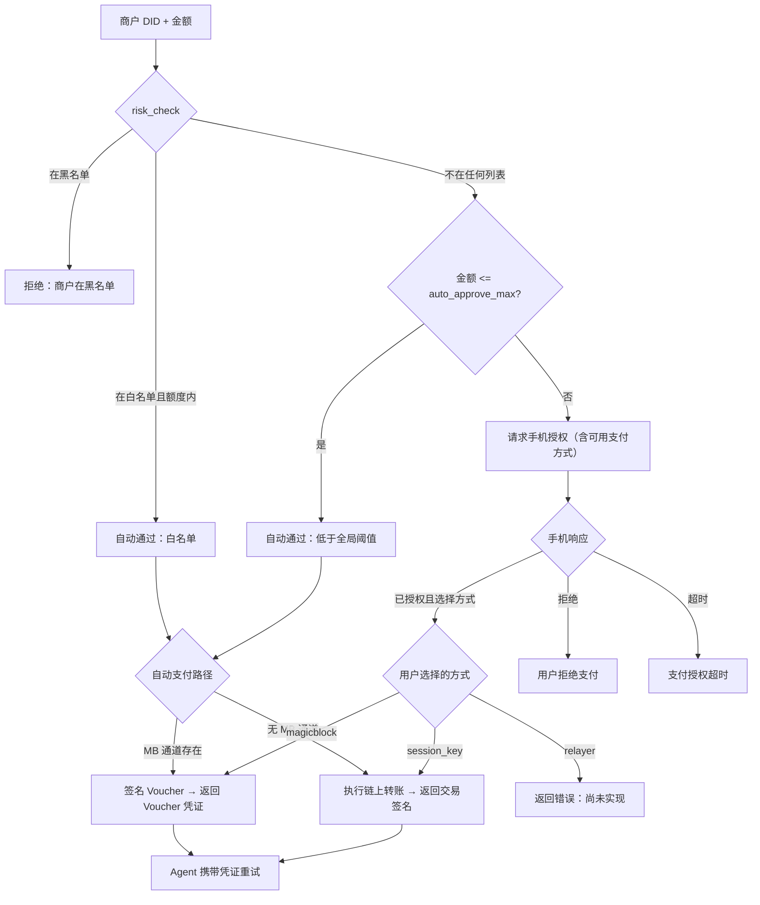

# Agent 支付流程

## 1. 概述

本文档描述 AI Agent 遇到 [x402 协议](https://www.x402.org/) 保护的付费资源时的端到端支付流程。

### 参与者

| 参与者 | 角色 |
|--------|------|
| **AI Agent** (OpenClaw) | 发起外部服务请求；接收 HTTP 402 支付挑战 |
| **外部服务** (x402) | 托管付费资源；返回 HTTP 402 及支付要求 |
| **Ignite Pay MCP** | 本地支付编排器：解析挑战、验证商户、管理授权、执行支付 |
| **DIDComm Mediator** | 加密 DIDComm 消息的中继服务器（MCP 与手机之间） |
| **手机 App** | 移动钱包，授权支付、创建 Session Key、签名交易 |
| **Solana 链** | 结算层，处理 SOL/SPL Token 转账、Session Key 合约、DID 账户 |
| **MagicBlock** | 统一全局资金池，按商户 Spending Cap 计费，链下 Voucher 签名，链上批量结算 |

### 触发条件

当 AI Agent 请求付费资源并收到 HTTP 402 响应时触发，响应中包含 Coinbase x402 标准格式或旧版 `accepts` 数组格式的支付要求。

### 支付路径

授权后，MCP 通过以下路径执行支付（用户在授权时选择）：

| 路径 | 机制 | 凭证类型 | 适用场景 |
|------|------|----------|----------|
| **Session Key** | 通过 Session Key 合约执行链上 SOL/SPL 转账 | Solana 交易签名 | 直接支付、一次性转账 |
| **MagicBlock 通道** | 从统一全局资金池签名链下 Voucher（买家签名 `SHA256(channel_id ‖ seq ‖ amount)`） | Voucher（消息哈希 + 买家签名） | 重复消费、通道支付 |
| **Relayer**（规划中） | 通过代付服务委托支付 | TBD | 第三方代付、无 Gas 场景 |

MCP 根据当前状态（如是否已建立 MagicBlock 通道）判断可用支付方式，并在 `payment-auth-request` 中告知手机。用户选择后，MCP 按选定路径执行。两种路径均返回支付凭证，Agent 用其重试原始请求。

---

## 2. 时序图

```mermaid
sequenceDiagram
    participant Agent as AI Agent
    participant MCP as Ignite Pay MCP
    participant Store as PaymentStore (sled)
    participant IPFS as IPFS
    participant Chain as Solana 链
    participant Mediator as DIDComm Mediator
    participant Phone as 手机 App

    Note over Agent,Phone: 步骤 1 — Agent 遇到付费墙
    Note over Agent: Agent 请求外部服务付费资源
    Note over Agent: 外部服务返回 HTTP 402 + 支付要求

    Note over Agent,MCP: 步骤 2 — Agent 调用 MCP
    Agent->>MCP: process_x402_challenge(challenge_body, headers)

    Note over MCP: 步骤 3 — 解析 x402 挑战
    MCP->>MCP: 解析 Coinbase x402 或旧版格式
    MCP->>MCP: 提取 network、amount、token、recipient、merchant_did

    Note over MCP,Store: 步骤 4 — 创建支付记录
    MCP->>Store: save_payment(PaymentRequest)
    Store-->>MCP: OK

    Note over MCP,IPFS: 步骤 5 — VC 验证
    alt 挑战中内嵌 VC
        MCP->>MCP: 从 JSON 解析 verifiable_credential
        MCP->>MCP: VC.verify(platform_key, platform_did)
    else 提供 IPFS CID
        MCP->>IPFS: resolve_vc_from_ipfs(cid)
        IPFS-->>MCP: VerifiableCredential JSON
        MCP->>MCP: VC.verify(platform_key, platform_did)
    else 无 VC
        MCP->>MCP: 跳过 VC 验证
    end

    Note over MCP,Chain: 步骤 6 — 链上商户 DID 验证
    MCP->>MCP: SolanaDidBridge.quick_verify(merchant_did)
    MCP->>Chain: Photon getCompressedAccount(derived_address)
    alt 账户存在
        Chain-->>MCP: 账户数据
        MCP->>MCP: 商户验证通过
    else 账户未找到
        Chain-->>MCP: null
        MCP-->>Agent: "支付拒绝：链上未找到商户"
    end

    Note over MCP: 步骤 7 — 风控决策
    MCP->>MCP: list_store.risk_check(merchant_did, amount)
    alt 在黑名单
        MCP-->>Agent: "支付拒绝：商户在黑名单"
    else 在白名单且额度内
        MCP->>MCP: 自动通过 → 执行支付
        MCP-->>Agent: 支付凭证
    else 在全局阈值内
        MCP->>MCP: 自动通过 → 执行支付
        MCP-->>Agent: 支付凭证
    else 需要授权
        MCP->>MCP: 继续请求手机授权
    end

    Note over MCP,Mediator,Phone: 步骤 8 — 向手机发送授权请求
    MCP->>MCP: 判断可用支付方式（session_key + 如有通道则加 magicblock）
    MCP->>Mediator: DIDComm payment-auth-request（含 available_payment_methods）
    Mediator->>Phone: 转发加密消息

    Note over Phone: 步骤 9 — 用户审核并授权
    Phone->>Phone: 显示支付详情 + 可用支付方式
    Phone->>Phone: 用户选择支付方式并点击 授权/拒绝

    Note over Phone,Chain,MCP: 步骤 10 — 手机发送授权响应
    Phone->>Phone: 可选创建 Session Key + 链上注册
    Phone->>Mediator: DIDComm 授权响应（approval + payment_method + 可选 session key）
    Mediator->>MCP: 转发加密响应

    Note over MCP,Chain: 步骤 11 — MCP 按用户选择执行支付
    alt 用户选择 MagicBlock 通道
        MCP->>MCP: mb_sign_voucher(channel_id, seq, amount)
        Note over MCP: 买家签名 SHA256(channel_id ‖ seq ‖ amount)
        MCP->>Store: 存储已签名 Voucher
        MCP-->>Agent: Voucher 凭证（msg_hash + signature）
    else 用户选择 Session Key 链上转账
        MCP->>Chain: 通过 session key 执行 execute_payment()
        Chain-->>MCP: 交易签名
        MCP->>Store: update_status(Executed)
        MCP-->>Agent: 交易签名凭证
    else 用户选择 Relayer（规划中）
        MCP-->>Agent: 错误：尚未实现
    end

    Note over Agent,MCP: 步骤 12 — Agent 携带凭证重试
    Agent->>External: 携带 X-Payment-Proof 头重试原始请求
    External->>External: 验证支付凭证（链上交易或 Voucher）
    External-->>Agent: 返回付费资源
```

---

## 3. 风控决策流程



---

## 4. 支付凭证类型

### 4.1 MagicBlock Voucher（链下）

当与商户存在支付通道时，MCP 链下签名 Voucher：

```
返回给 Agent 的 Voucher 凭证：
  Channel: <channel_pda>
  Seq: <序列号>
  Amount: <lamports>
  Signature: <base58 Ed25519 签名>
  Message hash: <base58 SHA256(channel_id ‖ seq ‖ amount)>
```

Voucher 本地存储在 sled（`VoucherStore`）中，用于后续批量结算。商户可通过 `settle_batch` 或 `optimistic_settle` 将批量 Voucher 链上结算。

**MCP 工具：** `mb_sign_voucher(merchant_pubkey, seq, amount)`

### 4.2 Session Key 交易（链上）

当不存在支付通道时，MCP 通过 Session Key 合约执行链上直接转账：

```
返回给 Agent 的交易凭证：
  "Payment authorized and executed. Tx: <base58 Solana 交易签名>
   Amount: <amount> <token>
   To: <recipient>"
```

**MCP 函数：** `execute_payment_auto(payment, session_key, spl_params)` — 优先尝试 MagicBlock，回退到 `execute_payment(session_key)` 执行链上转账

---

## 5. 代码位置

| 步骤 | 说明 | 文件 | 行号 |
|------|------|------|------|
| 3 | 解析 x402 挑战（Coinbase + 旧版） | `ignite-pay-mcp/src/main.rs` | ~478–530 |
| 3 | 解析 SPL Token mint | `ignite-pay-mcp/src/main.rs` | ~532–550 |
| 4 | 创建并保存支付记录 | `ignite-pay-mcp/src/main.rs` | ~551–575 |
| 5a | VC 验证（内嵌） | `ignite-pay-mcp/src/main.rs` | ~584–606 |
| 5b | VC 验证（IPFS CID） | `ignite-pay-mcp/src/main.rs` | ~607–646 |
| 6 | 链上 DID 验证 | `ignite-pay-mcp/src/main.rs` | ~648–668 |
| 6 | `quick_verify` 实现 | `ignite-pay-core/src/solana_did.rs` | 52–79 |
| 7 | 风控决策 | `ignite-pay-mcp/src/main.rs` | ~724–768 |
| 7 | 全局阈值自动通过 | `ignite-pay-mcp/src/main.rs` | ~770–801 |
| 8 | 判断可用支付方式 | `ignite-pay-mcp/src/main.rs` | `get_available_payment_methods()` |
| 8 | 发送 DIDComm 授权请求（含支付方式） | `ignite-pay-mcp/src/main.rs` | ~833–860 |
| 8 | DIDComm 消息构建 | `ignite-pay-mcp/src/mediator.rs` | ~267–320 |
| 8 | `PaymentMethod` 枚举 | `ignite-pay-core/src/didcomm.rs` | ~12–30 |
| 9–10 | 手机端桥接函数 | `ignite_pay_app/rust/src/api/simple.rs` | — |
| 10 | Session Key 创建 + 注册 | `ignite_pay_app/rust/src/api/session.rs` | — |
| 11a | `execute_payment`（Session Key 路径） | `ignite-pay-mcp/src/main.rs` | ~216–259 |
| 11 | `PaymentProof` 枚举 | `ignite-pay-mcp/src/main.rs` | ~262–291 |
| 11 | `try_mb_voucher_payment`（MagicBlock 路径） | `ignite-pay-mcp/src/main.rs` | ~294–362 |
| 11 | `execute_payment_auto`（支付方式分发器） | `ignite-pay-mcp/src/main.rs` | `execute_payment_auto()` |
| 11 | `has_mb_channel`（通道检查） | `ignite-pay-mcp/src/main.rs` | `has_mb_channel()` |
| 11b | `mb_sign_voucher`（独立工具） | `ignite-pay-mcp/src/main.rs` | ~1535–1580 |
| 11b | Voucher 签名逻辑 | `ignite-pay-mb/sdk/src/signing.rs` | 33–49 |
| 11b | Voucher 存储 | `ignite-pay-mcp/src/voucher_store.rs` | — |
| 12 | 结果返回给 Agent | `ignite-pay-mcp/src/main.rs` | ~900–960 |

### MagicBlock 通道生命周期工具

| 工具 | 文件:行号 | 说明 |
|------|-----------|------|
| `mb_init_global` | `main.rs:1320` | 创建全局状态 + Vault PDA（一次性） |
| `mb_deposit` | `main.rs:1344` | 向全局 Vault 存入 SOL |
| `mb_create_channel` | `main.rs:1369` | 开通与商户的支付通道 |
| `mb_update_spending_cap` | `main.rs:1405` | 调整商户 Spending Cap |
| `mb_get_channel` | `main.rs:1439` | 读取链上通道状态 |
| `mb_get_global_state` | `main.rs:1470` | 读取链上全局状态 |
| `mb_sign_voucher` | `main.rs:1493` | 签名链下支付 Voucher |
| `mb_sign_settlement` | `main.rs:1539` | 重建 Merkle Tree，签名批量结算 |
| `mb_dispute` | `main.rs:1619` | 对结算发起争议 |
| `mb_resolve_dispute` | `main.rs:1661` | 提供 Merkle Proof 解决争议 |
| `mb_withdraw` | `main.rs:1736` | 从 Vault 提取未分配 SOL |

---

## 6. 配置

相关 `config.toml` 字段：

```toml
[solana]
# Solana RPC 端点
rpc_url = "https://api.devnet.solana.com"
# DID 链上程序 ID（ignite-pay-did-program）— 启用链上 DID 验证
did_program_id = ""
# Photon RPC URL，用于 ZK Compression 查询 — quick_verify 使用
photon_url = ""
# 地址 Merkle Tree 公钥 — 用于推导压缩 DID 地址
address_tree = ""
# 支付模式："self_funded" 或 "sponsored"
pay_mode = "self_funded"
# 默认 owner 公钥 (base58)，用于本地 session 查询
default_owner = ""

[magicblock]
# MagicBlock RPC 端点
rpc_url = "https://api.devnet.solana.com"
# MagicBlock 链上程序 ID
program_id = "6pFXAg1oiV61wVvaJvMHqYdGMe2fscDwmN9UBUSvNuU3"

[policy]
# 低于此金额自动通过（最小单位，如 lamports）
auto_approve_max = 0
# 授权请求超时（秒）
auth_timeout = 300

[platform]
# 签发商户 VC 的平台 DID
did = "did:ignite:zPlatformDIDPlaceholder"
# 平台 Ed25519 验证密钥 (base64 无填充) — 用于 VC 验证
verifying_key_b64 = ""
```

---

## 7. 已知待办

| 项目 | 位置 | 状态 |
|------|------|------|
| VC 验证结果 | `ignite-pay-mcp/src/main.rs` | 结果已存储但未参与后续逻辑（`let _ = vc_verified;`）— 验证失败会提前返回，但成功不影响流程 |
| Agent x402 重试逻辑 | MCP 范围外 | Agent 需自行解析 MCP 返回的支付凭证并在重试时设置 `X-Payment-Proof` 头 |
| Relayer 支付方式 | `ignite-pay-core/src/didcomm.rs` | `PaymentMethod::Relayer` 枚举已存在但执行返回错误 — 尚未实现 |

---

## 8. 支付方式选择流程

当 MCP 需要手机授权（非自动通过）时，按以下流程选择支付方式：

### 8.1 MCP 判断可用方式

```rust
fn get_available_payment_methods(&self, merchant_did: &str) -> Vec<PaymentMethod> {
    // 1. Session Key 始终可用
    // 2. 如与商户存在 MagicBlock 通道（链上检查），则 magicblock 可用
}
```

### 8.2 手机展示可选方式

`payment-auth-request` 包含 `available_payment_methods` 数组：
```json
{
  "payment_id": "pay-123",
  "merchant_did": "did:ignite:zMerchant",
  "amount": 500000000,
  "description": "...",
  "available_payment_methods": ["session_key", "magicblock"]
}
```

### 8.3 用户在手机响应中选择方式

`payment-auth-response` 包含用户的 `payment_method` 选择：
```json
{
  "payment_id": "pay-123",
  "authorized": true,
  "payment_method": "magicblock",
  "session_key_pubkey": "...",
  "..."
}
```

### 8.4 MCP 按选择方式执行

| 用户选择 | MCP 动作 |
|----------|----------|
| `session_key` | 通过 Session Key 合约执行链上 SOL/SPL 转账 |
| `magicblock` | 链下 Voucher：`SHA256(channel_id ‖ seq ‖ amount)` + Ed25519 签名 |
| `relayer` | 错误：尚未实现 |

自动通过的支付（白名单或全局阈值）不涉及手机交互。MCP 使用默认自动策略：优先 MagicBlock（如可用），回退 Session Key。
