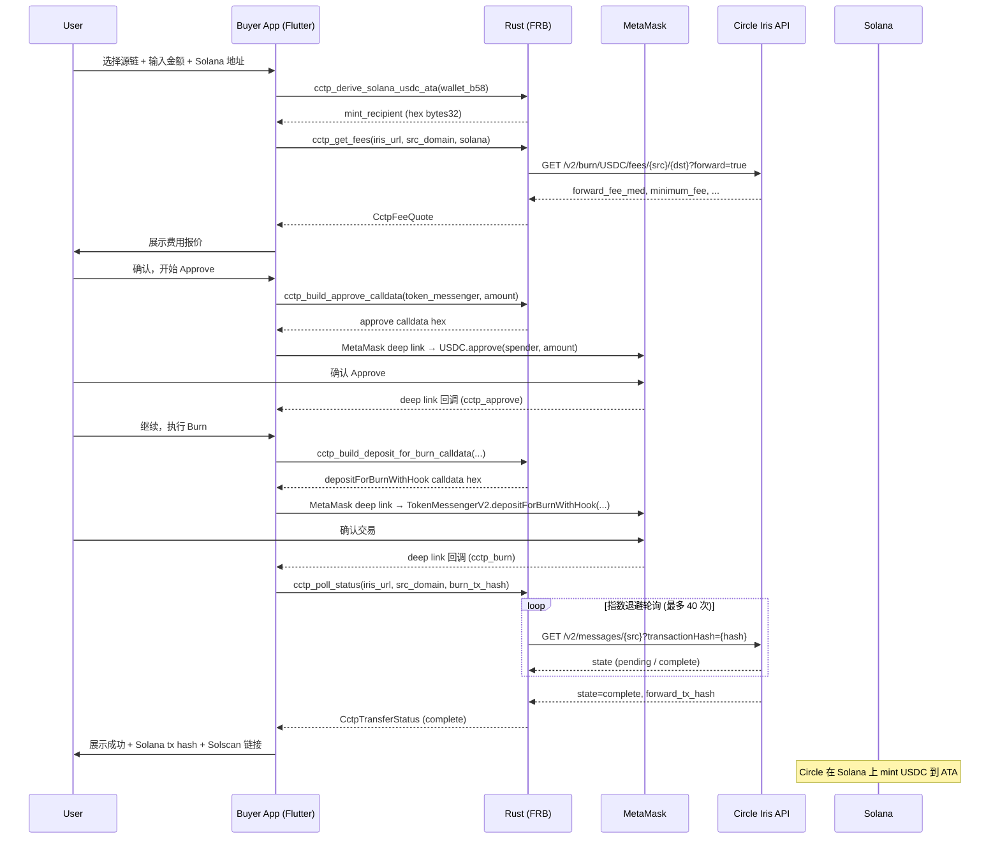

# CCTP Forwarding — EVM 到 Solana 跨链 USDC 充值

## 概述

买家手机应用（Ignite Pay App）支持一键将 USDC 从 EVM 链（Ethereum / Base / Arbitrum / OP）跨链转移到 Solana 钱包，使用 Circle CCTP V2 Forwarding 协议。用户通过 MetaMask 完成链上操作。

**支持源链：** Ethereum、Base、Arbitrum、OP

**不支持：** SUI（CCTP V1 legacy 即将废弃）、Tron（不支持 CCTP）

## 参与者

| 角色 | 说明 |
|------|------|
| **Buyer App** | Ignite Pay 移动端 (Flutter) |
| **Rust 层** | FRB 桥接，负责 Iris API 调用、ABI 编码、ATA 推导 |
| **MetaMask** | 用户 EVM 钱包，执行 approve 和 depositForBurnWithHook |
| **Circle Iris** | CCTP 中继服务，负责费用报价和跨链 attestation |
| **Solana** | 目标链，接收 mint 的 USDC |

## 流程



## 合约地址

### 源链 Domain ID & 合约

| 链 | Domain ID | TokenMessengerV2 | USDC |
|----|-----------|-----------------|------|
| Ethereum | 0 | `0xBD3fa9AE8AcB092cC21E555769777B85a666E4db` | `0xA0b86991c6218b36c1d19D4a2e9Eb0cE3606eB48` |
| Base | 6 | `0x9DAF7a48A68C0c2a88289f3f987a1e8D25d58685` | `0x833589fCD6eDb6E08f4c7C32D4f71b54bdA02913` |
| Arbitrum | 3 | `0x19330d10D9Cc8751218eaf51E8885D058642E08A` | `0xaf88d065e77c8cC2239327C5EDb3A432268e5831` |
| OP | 2 | `0x9DAF7a48A68C0c2a88289f3f987a1e8D25d58685` | `0x0b2C639c533813f4Aa9D7837CAf62653d097Ff85` |
| **Solana** | **5** | — | `EPjFWdd5AufqSSqeM2qN1xzybapC8G4wEGGkZwyTDt1v` |

### Forwarding Hook Data

固定值，嵌入 `depositForBurnWithHook` 的 `hookData` 参数：

```
0x636374702d666f72776172640000000000000000000000000000000000000000
```

（即 `cctp-forward` 左填充零到 32 字节）

## ABI 编码

所有 EVM 合约调用的 calldata 在 Rust 侧手动 ABI 编码，不引入 ethers/alloy 库。

### approve(address spender, uint256 amount)

- Selector: `0x095ea7b3`
- 参数: `pad32(spender_address) + pad256(amount)`

### depositForBurnWithHook(uint64, uint32, bytes32, address, bytes32, bytes32, uint32, uint32)

- Selector: `0xf93a5932`
- 参数 (8 个):
  1. `uint64 amount` — USDC 数量 (6 位小数)
  2. `uint32 destinationDomain` — 目标链 Domain ID (Solana = 5)
  3. `bytes32 mintRecipient` — Solana USDC ATA 地址 (hex bytes32)
  4. `address burnToken` — 源链 USDC 合约地址
  5. `bytes32 destinationCaller` — 全零表示任意调用者
  6. `bytes32 hookData` — 固定 forwarding hook data
  7. `uint32 maxFee` — 最大可接受手续费
  8. `uint32 minFinalityThreshold` — 最小终局性阈值

## ATA 推导

`mintRecipient` 使用 Solana 的 `find_program_address` 推导：

```
seeds = [owner, token_program, usdc_mint, ata_program]
nonce = 255..0 (迭代直到找到 off-curve PDA)
hash = SHA-256(seeds || nonce)
```

- ATA Program: `ATokenGPvbdGVxr1b2hvZbsiqW5xWH25efTNsLJA8knL`
- Token Program: `TokenkegQfeZyiNwAJbNbGKPFXCWuBvf9Ss623VQ5DA`
- USDC Mint: `EPjFWdd5AufqSSqeM2qN1xzybapC8G4wEGGkZwyTDt1v`

推导结果转 hex 字符串（64 字符）作为 `mintRecipient` 传入 CCTP。

## 代码位置

| 层 | 文件 | 说明 |
|----|------|------|
| Rust 核心 | `rust/src/api/cctp_transfer.rs` | 费用查询、ABI 编码、ATA 推导、状态轮询 |
| Rust 桥接 | `rust/src/api/simple.rs` | 5 个 FRB bridge 包装函数 |
| Flutter 服务 | `lib/services/cctp_service.dart` | 状态机管理、合约配置、流程编排 |
| EVM 钱包 | `lib/services/evm_wallet_service.dart` | MetaMask deep link 构造与启动 |
| UI | `lib/cctp_transfer_screen.dart` | 跨链充值界面 (3 步指示器 + 表单 + 进度) |
| 仪表盘入口 | `lib/main.dart` | `_QuickNavRow` 的 "Deposit" 卡片 |
| Deep link | `lib/main.dart` | `cctp_approve` / `cctp_burn` 路由 |

### Rust 函数清单

| 函数 | 用途 |
|------|------|
| `cctp_get_fees(iris_url, src, dst)` | 查询 Forwarding 手续费 |
| `cctp_build_approve_calldata(spender, amount)` | 构建 approve calldata |
| `cctp_build_deposit_for_burn_calldata(...)` | 构建 depositForBurnWithHook calldata |
| `cctp_derive_solana_usdc_ata(wallet_b58)` | 推导 Solana USDC ATA |
| `cctp_poll_status(iris_url, src, burn_hash)` | 轮询转账状态 |

### Flutter 状态机

```
idle → fetching_fees → approving → burning → polling → done
                                                   ↘ error
```

## Deep Link

### MetaMask URL 格式

```
https://metamask.app.link/send/{contract}?data={calldata}&value=0&redirect=ignitepay://{path}
```

| 操作 | to 地址 | redirect path |
|------|---------|---------------|
| Approve | USDC 合约 | `ignitepay://cctp_approve` |
| Burn | TokenMessengerV2 | `ignitepay://cctp_burn` |

### 回调处理

MetaMask deep link 不保证可靠返回交易哈希。因此：
- approve/burn 回调仅用于确认用户已操作完成
- 用户需在 UI 中手动粘贴 burn tx hash，或由轮询逻辑自动处理

## 已知限制

1. **MetaMask deep link 可靠性** — `metamask.app.link/send/` 对合约调用的支持因版本/平台而异。降级方案为显示 calldata hex + 复制按钮 + 手动操作指引。
2. **Attestation 延迟** — 主网 Circle attestation 可能需要 10-30 分钟。UI 允许用户离开页面后回来查看，轮询使用指数退避（初始 15 秒，上限 120 秒，最多 40 次）。
3. **无 ethers/alloy 依赖** — ABI 编码手动实现，避免 50+ 传递依赖膨胀移动端二进制。
4. **Gas 估算** — 由 MetaMask 钱包端处理，Rust 侧不参与。
5. **仅支持 USDC** — 当前不支持其他 ERC-20 代币的 CCTP 转移。

## 测试

```bash
# Rust 单元测试
cd ignite_pay_app/rust && cargo test --lib api::cctp_transfer

# Flutter 分析
cd ignite_pay_app && flutter analyze lib/services/cctp_service.dart \
  lib/services/evm_wallet_service.dart \
  lib/cctp_transfer_screen.dart

# 功能验证 (testnet)
# 1. 选择 Base → Solana
# 2. 输入金额，获取手续费报价
# 3. MetaMask approve + burn
# 4. 等待 Solana 到账
```
