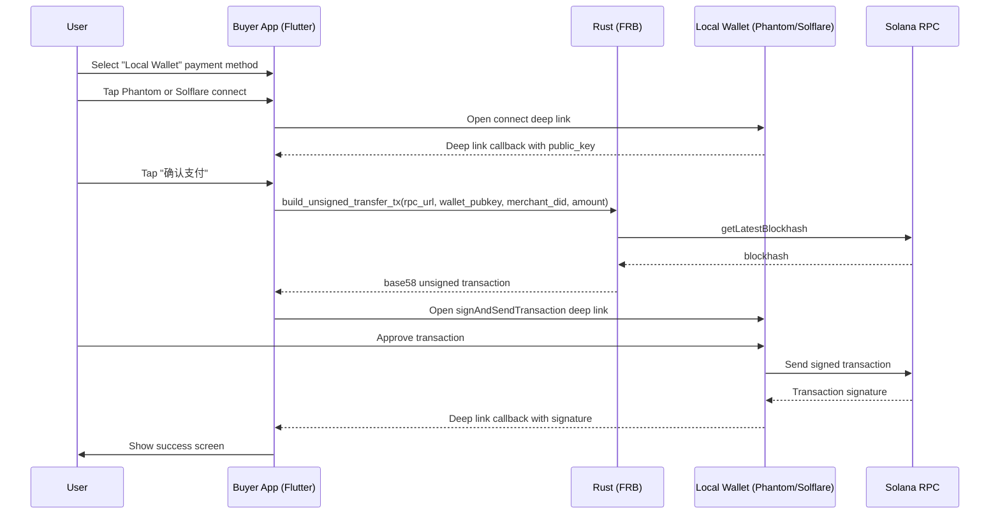

# Direct Wallet Payment Flow

## Overview

The direct wallet payment path allows the mobile app to pay a merchant by invoking a locally installed wallet (Phantom or Solflare) to sign and send a SOL transfer transaction. This path completely bypasses the MCP server.

**Participants:**
- **Buyer App** — Ignite Pay mobile app (Flutter)
- **Local Wallet** — Phantom or Solflare installed on the same device
- **Merchant** — Identified by `did:ignite:z...`

**Trigger:** User selects "Local Wallet" as the payment method on the QR payment screen.

## Sequence

## Comparison with MCP-mediated Path

| Aspect | MCP-mediated | Direct Wallet |
|--------|-------------|---------------|
| Server dependency | Requires MCP server | None |
| Signing key | Session key or MCP key | User's wallet key |
| DIDComm encryption | Required | Not used |
| Latency | Higher (server round-trip) | Lower (direct) |
| Wallet requirement | None (session keys) | Phantom/Solflare installed |
| Key management | App-generated ephemeral keys | Wallet-managed keys |

## Deep Link URL Formats

### Connect

| Wallet | URL |
|--------|-----|
| Phantom | `https://phantom.app/ul/v1/connect?dapp_encryption_public_key=placeholder&redirect_link=ignitepay://wallet_connect&cluster=devnet` |
| Solflare | `solflare://v1/connect?dapp_encryption_public_key=placeholder&redirect_link=ignitepay://wallet_connect&cluster=devnet` |

### Sign & Send

| Wallet | URL |
|--------|-----|
| Phantom | `https://phantom.app/ul/v1/signAndSendTransaction?dapp_encryption_public_key=placeholder&payload={tx_b58}&redirect_link=ignitepay://direct_pay&cluster=devnet` |
| Solflare | `solflare://v1/signAndSendTransaction?dapp_encryption_public_key=placeholder&payload={tx_b58}&redirect_link=ignitepay://direct_pay&cluster=devnet` |

### Callback URLs (ignitepay:// scheme)

| Path | Parameters | Handler |
|------|-----------|---------|
| `ignitepay://wallet_connect` | `public_key` | `DirectPaymentService.handleConnectCallback()` |
| `ignitepay://direct_pay` | `signature` (success) or `errorCode` (failure) | `DirectPaymentService.handlePaymentCallback()` |
| `ignitepay://onchain` | `signature` | `SessionKeyService.completeRegistration()` |

## Code Location Map

| Step | File | Function/Widget |
|------|------|-----------------|
| Build unsigned tx | `rust/src/api/session.rs` | `build_unsigned_transfer_tx()` |
| Bridge wrapper | `rust/src/api/simple.rs` | `build_unsigned_transfer_tx()` |
| Connect URL builder | `lib/services/wallet_deep_link_service.dart` | `buildPhantomConnectUrl()` / `buildSolflareConnectUrl()` |
| Payment orchestration | `lib/services/direct_payment_service.dart` | `DirectPaymentService` (singleton) |
| Deep link routing | `lib/main.dart` | `_handleDeepLink()` |
| Payment method UI | `lib/qr_payment_screen.dart` | `_buildWalletConnectSection()` |
| iOS URL scheme | `ios/Runner/Info.plist` | `CFBundleURLSchemes: ignitepay` |

## Known Limitations

1. **Placeholder encryption** — `dapp_encryption_public_key=placeholder` is used for devnet/testing. Production requires proper ECDH key agreement.
2. **Blockhash expiry** — The unsigned transaction includes a `recent_blockhash` that expires after ~60 seconds. If the user delays signing, the transaction will fail.
3. **iOS Universal Links** — Phantom on iOS uses universal links (`https://phantom.app/ul/...`) which should work; Solflare uses custom URL schemes (`solflare://`) which require the app to be installed.
4. **No SPL token support** — Currently only SOL transfers are supported. SPL token (USDC/USDT) support would require adding Token Program instructions.
5. **No transaction simulation** — The flow doesn't pre-simulate the transaction to check for errors before sending.
