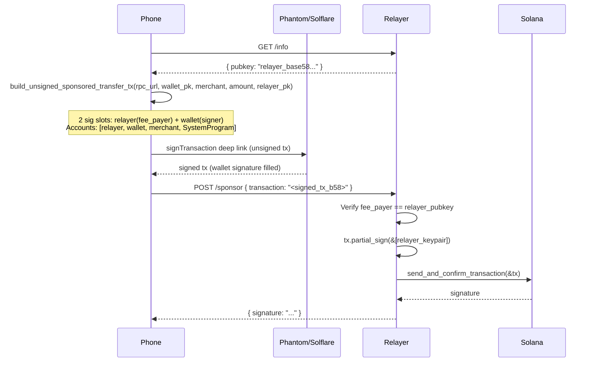
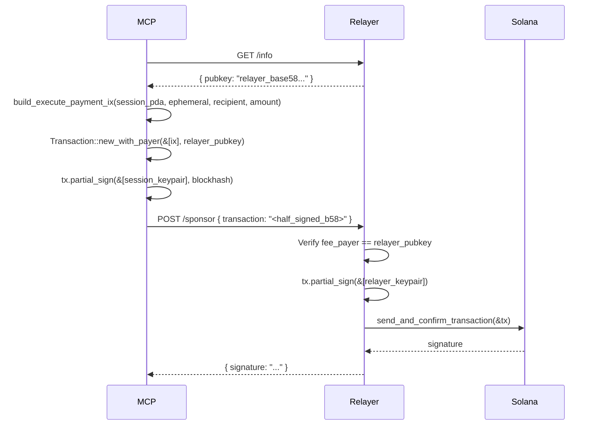
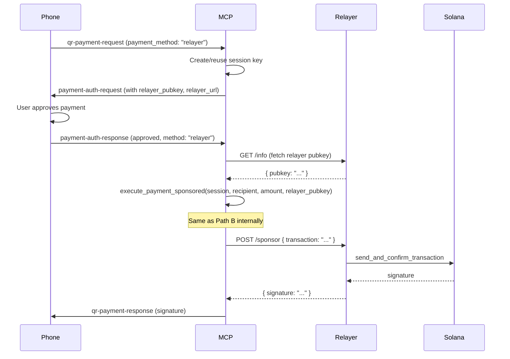

# Sponsored (Relayer) Payment Flow

## Overview

In the sponsored payment mode, gas fees are paid by a **Relayer** service instead of the user's wallet. The Relayer acts as the `fee_payer` in Solana transactions: it receives partially-signed transactions, adds its own signature, and broadcasts to the network.

### Participants

| Role | Description |
|------|-------------|
| **Phone App** | Mobile wallet (Phantom/Solflare) that signs transactions |
| **MCP Server** | AI agent payment orchestrator managing sessions |
| **Relayer** | HTTP service that pays gas by co-signing transactions |
| **Session Key** | Ephemeral keypair for recurring payments (MCP-managed) |

### Payment Paths

| # | Path | Signer | Fee Payer | Trigger |
|---|------|--------|-----------|---------|
| A | Phone → Local Wallet → Relayer | Local wallet (Phantom/Solflare) | Relayer | Phone scans QR, selects "Sponsored" |
| B | MCP → Session Key → Relayer | MCP session key | Relayer | x402 challenge auto-exec / QR selects session_key with sponsored mode |
| C | Phone → DIDComm → MCP → Session Key → Relayer | MCP session key | Relayer | Phone scans QR, selects "Session Key" and MCP is in sponsored mode |

**Core pattern:** Build a Solana transaction with `fee_payer = relayer_pubkey`, the signer partial-signs, then sends the half-signed tx to `POST /sponsor` on the Relayer. The Relayer adds the fee_payer signature and broadcasts.

---

## Sequence Diagrams

### Path A: Phone → Local Wallet → Relayer



### Path B: MCP → Session Key → Relayer



### Path C: Phone → DIDComm → MCP → Session Key → Relayer



---

## Relayer API

### `GET /info`

Returns the Relayer's fee-payer public key.

**Response:**
```json
{
  "pubkey": "Base58EncodedPublicKey..."
}
```

### `POST /sponsor`

Accepts a partially-signed transaction, adds the fee-payer signature, and broadcasts.

**Request:**
```json
{
  "transaction": "Base58EncodedPartiallySignedTransaction..."
}
```

**Success Response (200):**
```json
{
  "signature": "Base58EncodedTransactionSignature..."
}
```

**Error Responses:**
- `400` — Invalid base58 or malformed transaction
- `403` — Fee payer mismatch (transaction fee_payer != relayer pubkey)
- `500` — Failed to get blockhash or broadcast transaction

---

## Comparison: SelfFunded vs Sponsored

| Aspect | SelfFunded | Sponsored |
|--------|-----------|-----------|
| Gas payer | Session key / user wallet | Relayer service |
| Who signs | Signer only | Signer + Relayer |
| Transaction flow | Sign → broadcast directly | Sign → POST /sponsor → Relayer broadcasts |
| Session key funding | Needs SOL for gas | No gas funding needed |
| Configuration | `pay_mode = "self_funded"` | `pay_mode = "sponsored"` + `relayer_url` |
| Phone App deep link | `signAndSendTransaction` | `signTransaction` (no auto-send) |
| Additional infra | None | Relayer service |

---

## Code Locations

| Component | File | Key Functions |
|-----------|------|---------------|
| Relayer service | `ignite-pay-relayer/src/main.rs` | `get_info`, `post_sponsor` |
| Sponsored SOL transfer | `ignite-pay-solana/src/payment.rs` | `execute_sol_transfer_sponsored` |
| Sponsored SPL transfer | `ignite-pay-solana/src/payment.rs` | `execute_spl_transfer_sponsored` |
| Relayer HTTP call | `ignite-pay-solana/src/payment.rs` | `send_to_relayer`, `fetch_relayer_pubkey` |
| MCP relayer branch | `ignite-pay-mcp/src/main.rs` | `execute_payment_auto` (Some("relayer")) |
| MCP available methods | `ignite-pay-mcp/src/main.rs` | `get_available_payment_methods` |
| Auth request with relayer | `ignite-pay-core/src/didcomm.rs` | `build_authorization_request_with_relayer` |
| Phone Rust: fetch pubkey | `ignite_pay_app/rust/src/api/session.rs` | `fetch_relayer_pubkey` |
| Phone Rust: build tx | `ignite_pay_app/rust/src/api/session.rs` | `build_unsigned_sponsored_transfer_tx` |
| Phone Dart wrappers | `ignite_pay_app/lib/src/rust/api/simple.dart` | `fetchRelayerPubkey`, `buildUnsignedSponsoredTransferTx` |
| Wallet deep links | `ignite_pay_app/lib/services/wallet_deep_link_service.dart` | `buildPhantomSignTransactionUrl` |
| Direct payment svc | `ignite_pay_app/lib/services/direct_payment_service.dart` | `executeSponsoredPayment` |
| QR payment screen | `ignite_pay_app/lib/qr_payment_screen.dart` | `_onConfirmSponsoredPayment` |
| Deep link handler | `ignite_pay_app/lib/main.dart` | `_handleDeepLink` (sponsored_sign) |
| Settings | `ignite_pay_app/lib/settings_screen.dart` | Relayer URL field |

---

## Configuration

### MCP config.toml

```toml
[solana]
pay_mode = "sponsored"
relayer_url = "http://localhost:3030"
```

### Relayer config.toml

```toml
[relayer]
keypair_b58 = ""  # Leave empty to auto-generate on first startup
rpc_url = "https://api.devnet.solana.com"
listen_addr = "0.0.0.0:3030"
rate_limit = 60
```

### Phone App Settings

- **Payment Mode:** Select "Sponsored" in Settings
- **Relayer URL:** Configure in Settings → appears when "Sponsored" is selected

---

## Deployment

### Starting the Relayer

```bash
cd ignite-pay-relayer
cargo run --release
```

On first run with an empty `keypair_b58`, the Relayer generates a new keypair and prints it. Copy the keypair to `config.toml` to persist it across restarts.

Fund the Relayer's pubkey on devnet:
```bash
solana transfer <RELAYER_PUBKEY> 1 --url devnet --allow-unfunded-recipient
```

### Starting MCP in sponsored mode

```bash
cd ignite-pay-mcp
# Edit config.toml: set pay_mode = "sponsored" and relayer_url
cargo run --release
```

---

## Security Considerations

1. **Fee payer validation:** The Relayer verifies that `tx.message.account_keys[0]` matches its own pubkey before signing. This prevents arbitrary transaction sponsorship.

2. **Rate limiting:** The `rate_limit` config controls max requests per minute per IP (configurable, currently informational).

3. **Key management:** The Relayer's keypair should be stored securely. In production, use environment variables or a secrets manager instead of `config.toml`.

4. **Network:** Run the Relayer behind a reverse proxy (nginx/cloudflare) with TLS in production.

5. **Funding risk:** The Relayer's SOL balance is the attack surface. Monitor it and set spending limits.

6. **Transaction inspection:** The Relayer could inspect transaction instructions before signing to enforce additional policy (amount limits, allowed programs, etc.).
